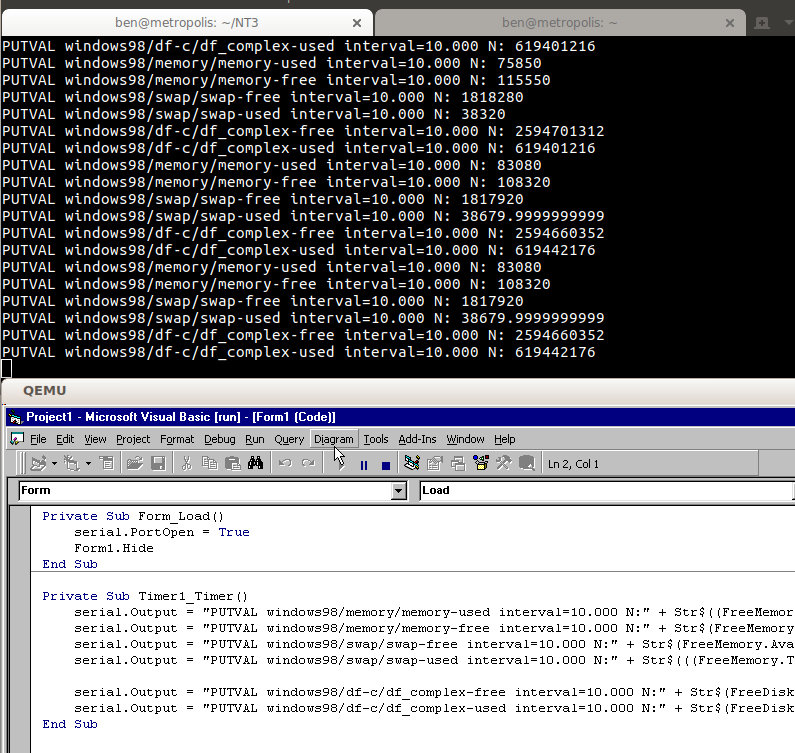

# win32-collectd 

This small VB6 program outputs over COM1 collectd strings about the state of the system, you can use this on your hypervisor to export it into collectd and your
monitoring/metrics solution.

I feel bad for you if you are running windows 98 in a even slighly production function.
